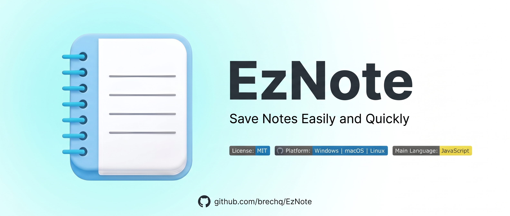

<div align="center">



# EzNote

**A simple, fast, and distraction-free desktop note-taking app.**

[](https://github.com/brechq/EzNote/releases)
[](LICENSE)
[](https://www.electronjs.org/)

</div>

---

## Overview

**EzNote** is a desktop note-taking application designed around simplicity, speed, and local-first storage.

Instead of adding unnecessary complexity, EzNote focuses on the essentials: writing notes, organizing them, searching through them, and keeping everything available locally on your device.

No account.
No cloud dependency.
No unnecessary setup.

---

## Features

### Note Management

* Create notes instantly
* Edit notes with automatic saving
* Mark notes as favorites
* Move notes to Trash
* Restore deleted notes
* Permanently delete notes

### Fast Search

Search through your notes by:

* Note title
* Note content

Search results update instantly while typing.

### Local-First Storage

EzNote stores your notes locally using `localStorage`.

Your notes remain available after restarting the application without requiring an account or remote database.

### Light & Dark Mode

Switch between Light Mode and Dark Mode.

Your selected theme is automatically saved and restored the next time you launch EzNote.

### Three-Panel Interface

EzNote uses a three-panel workspace designed to keep navigation, notes, and editing within a single view.

```text
┌──────────────┬──────────────────┬─────────────────────────┐
│              │                  │                         │
│   Sidebar    │    Note List     │      Note Editor        │
│              │                  │                         │
│  Navigation  │   Your Notes     │    Write & Edit         │
│              │                  │                         │
└──────────────┴──────────────────┴─────────────────────────┘
```

The layout keeps the main parts of the application accessible without unnecessary interface clutter.

### Keyboard Support

EzNote includes keyboard shortcuts for common actions, making navigation and editing faster without relying entirely on the mouse.

---

## Keyboard Shortcuts

| Shortcut               | Action                                                |
| ---------------------- | ----------------------------------------------------- |
| `Ctrl + N` / `Cmd + N` | Create a new note                                     |
| `Ctrl + F` / `Cmd + F` | Focus the search field                                |
| `Ctrl + B` / `Cmd + B` | Toggle **Bold**                                       |
| `Ctrl + I` / `Cmd + I` | Toggle *Italic*                                       |
| `Escape`               | Clear search or cancel selection                      |
| `Delete` / `Backspace` | Delete the active note when the editor is not focused |

> On Windows and Linux, use `Ctrl`. On macOS, use `Cmd`.

---

## Getting Started

### Requirements

Before running EzNote from source, make sure you have:

* [Node.js](https://nodejs.org/) installed
* Git installed

### Clone the Repository

```bash
git clone https://github.com/brechq/EzNote.git
cd EzNote
```

### Install Dependencies

```bash
npm install
```

### Run in Development

```bash
npm start
```

EzNote will launch as a desktop application.

---

## Build for Windows

EzNote uses Electron Builder for application packaging.

To create a Windows build:

```bash
npm run dist
```

Build files will be generated inside:

```text
dist/
```

Depending on the configured Electron Builder targets, the output may include an installer and/or portable executable.

---

## Tech Stack

| Technology             | Purpose                            |
| ---------------------- | ---------------------------------- |
| **Electron**           | Desktop application runtime        |
| **HTML5**              | Application structure              |
| **Modern CSS**         | Layout, styling, and themes        |
| **Vanilla JavaScript** | Application logic and interactions |
| **localStorage**       | Local note persistence             |
| **Electron Builder**   | Application packaging              |

---

## Project Structure

```text
EzNote/
├── index.html
├── style.css
├── script.js
├── main.js
├── package.json
├── readmebanner.jpg
└── assets/
    └── ...
```


---


## Contributing

Contributions, suggestions, and improvements are welcome.

If you find a bug or have an idea for EzNote, open an issue or submit a pull request on GitHub.

Before submitting a large change, consider opening an issue first so the proposed direction can be discussed.

---

## License

EzNote is released under the **MIT License**.

See the [`LICENSE`](LICENSE) file for the full license text.

---
